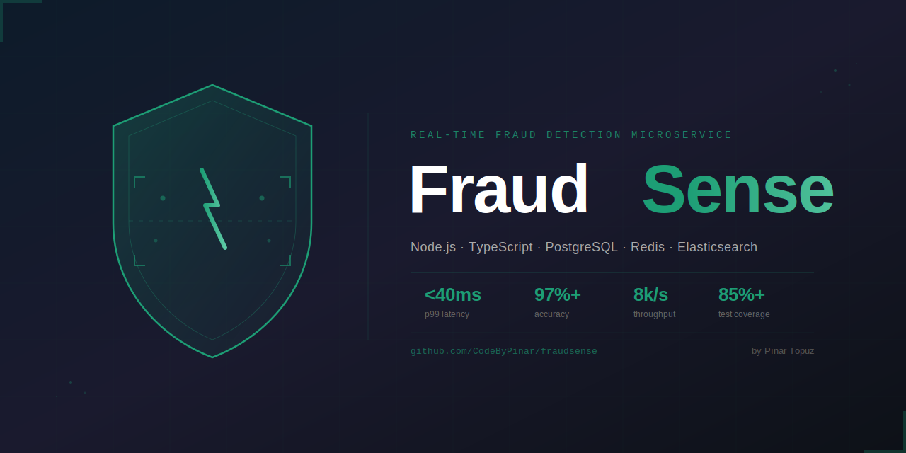
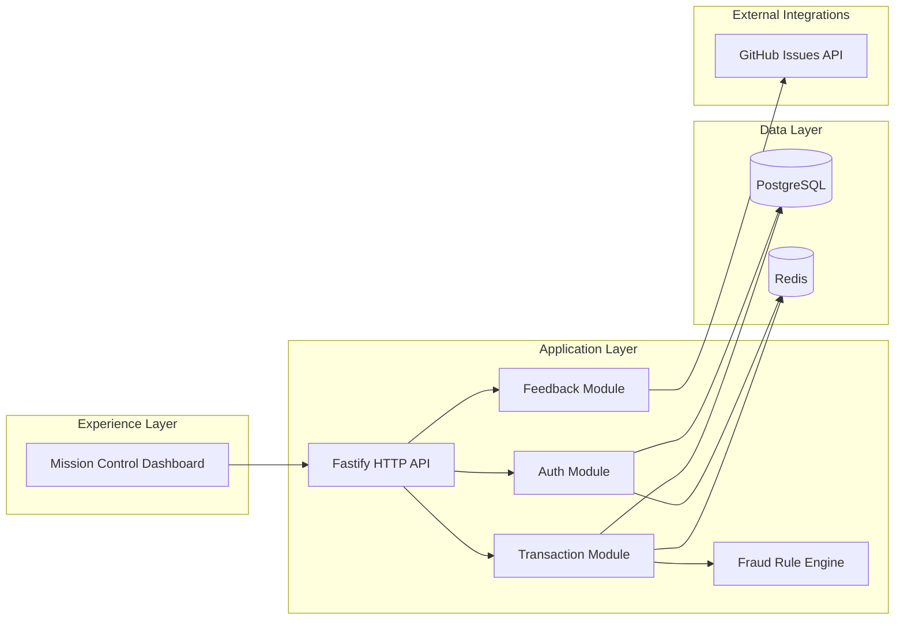
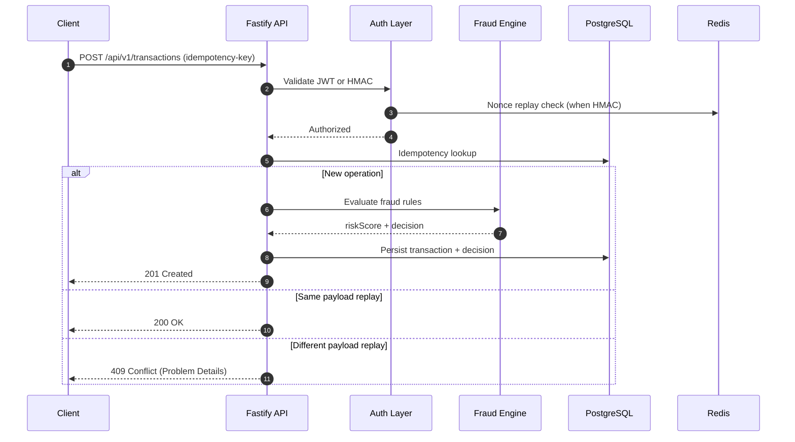
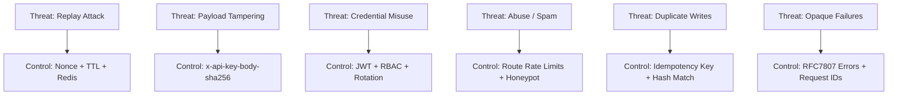

# FraudSense

I am building FraudSense as a security-first, developer-friendly fraud detection platform that is simple to run locally and realistic enough to evolve into production.



## Project Widgets


## Table of Contents

1. [Vision](#vision)
2. [What Makes FraudSense Different](#what-makes-fraudsense-different)
3. [System Architecture](#system-architecture)
4. [Runtime Dataflow](#runtime-dataflow)
5. [Threat Model Snapshot](#threat-model-snapshot)
6. [Feature Deep Dive](#feature-deep-dive)
7. [Mission Control UI](#mission-control-ui)
8. [API Contract](#api-contract)
9. [Configuration Matrix](#configuration-matrix)
10. [Setup and Runbook](#setup-and-runbook)
11. [Feedback to GitHub Issues](#feedback-to-github-issues)
12. [Operational Playbooks](#operational-playbooks)
13. [Roadmap](#roadmap)
14. [Author](#author)

## Vision

FraudSense focuses on one question:

How can we evaluate risky transactions in real time while preserving reliability, auditability, and developer speed?

My answer in this project is:
- deterministic idempotency
- layered auth model (JWT + HMAC)
- transparent risk pipeline
- an operational UI that explains itself

## What Makes FraudSense Different

- Security and usability are treated as first-class citizens together.
- APIs are designed for both humans and machine clients.
- Mission Control UI is not decorative; it is operational.
- Feedback flow is built to be safe and actionable (GitHub issue pipeline).

## System Architecture



## Runtime Dataflow



## Threat Model Snapshot



## Feature Deep Dive

### Transaction Reliability
- strict schema validation
- idempotency-key enforcement
- deterministic replay semantics
- conflict isolation (`409`) for mismatched replays

### Fraud Intelligence
- modular rule pipeline
- weighted scoring strategy
- clear separation between rule evaluation and persistence

### Auth and Security
- JWT authentication for user-based access
- refresh token rotation
- RBAC for privilege boundaries
- service-to-service HMAC authentication
- replay and tamper protections

### Feedback Intelligence
- feedback form with UX-grade notifications
- backend validation and abuse controls
- secure forwarding to GitHub Issues

## Mission Control UI

The dashboard (`GET /`) includes:
- live operation center (liveness/readiness/DB/Redis)
- response-time telemetry chips
- risk simulation panel
- service topology interaction map
- live event stream
- API explorer with one-click command copy
- secure feedback center with user-friendly status notices

## API Contract

### Health
- `GET /health/live`
- `GET /health/ready`

### Auth
- `POST /api/v1/auth/login`
- `POST /api/v1/auth/refresh`

### Transactions
- `POST /api/v1/transactions`
- `GET /api/v1/transactions`

### Feedback
- `POST /api/v1/feedback`

### Service HMAC Headers
- `x-api-key-id`
- `x-api-key-timestamp`
- `x-api-key-nonce`
- `x-api-key-body-sha256`
- `x-api-key-signature`

Signature format:

`HMAC_SHA256(secret, METHOD + "\n" + PATH + "\n" + TIMESTAMP + "\n" + NONCE + "\n" + BODY_HASH)`

## Configuration Matrix

| Variable | Required | Purpose |
|---|---:|---|
| `NODE_ENV` | Yes | Runtime mode (`development/test/production`) |
| `PORT` | Yes | HTTP port (default local: `3002`) |
| `REPOSITORY_MODE` | Yes | Data backend (`memory` or `prisma`) |
| `DATABASE_URL` | Yes | PostgreSQL connection string |
| `REDIS_URL` | Yes | Redis connection string |
| `JWT_PUBLIC_KEY` | Yes | JWT verification key |
| `JWT_PRIVATE_KEY` | Yes | JWT signing key |
| `GITHUB_FEEDBACK_TOKEN` | Optional | Enables feedback issue creation |
| `GITHUB_FEEDBACK_REPO_OWNER` | Optional | Target GitHub owner/org |
| `GITHUB_FEEDBACK_REPO_NAME` | Optional | Target repository |
| `GITHUB_FEEDBACK_LABELS` | Optional | Default issue labels |

## Setup and Runbook

### 1) Install

```bash
npm install
```

### 2) Start Infrastructure

```bash
docker compose up -d postgres redis
```

### 3) Verify Tooling

```bash
npm run type-check
npm test -- --runInBand
```

### 4) Start Service

```bash
npm run dev
```

Open:
- `http://localhost:3002/`

### 5) Local E2E

```bash
bash docs/e2e-curl.sh
```

Windows:

```powershell
powershell -ExecutionPolicy Bypass -File .\docs\e2e-curl.ps1
```

## Feedback to GitHub Issues

Set these variables in `.env`:

```dotenv
GITHUB_FEEDBACK_TOKEN=<fine-grained-token>
GITHUB_FEEDBACK_REPO_OWNER=CodeByPinar
GITHUB_FEEDBACK_REPO_NAME=fraudsense
GITHUB_FEEDBACK_LABELS=feedback,triage
```

Recommended token scope:
- Repository access: only `fraudsense`
- Permission: `Issues -> Read and write`

Optional (if same token also used for HTTPS Git):
- `Contents -> Read and write`

## Operational Playbooks

### Service does not start
1. Check if port is occupied.
2. Confirm PostgreSQL and Redis are reachable.
3. Validate `.env` for malformed values.

### Readiness is down
1. Hit `GET /health/ready`.
2. Inspect `checks.database` and `checks.redis` fields.
3. Validate Docker containers and credentials.

### Feedback submission fails
1. Verify `GITHUB_FEEDBACK_*` values.
2. Confirm token permission for issue write.
3. Inspect API response problem detail payload.

## Roadmap

Planned innovations:
- adaptive risk thresholds by merchant profile
- asynchronous scoring queue mode for high-volume traffic
- search and forensic views backed by Elasticsearch
- SLO-backed alerting and incident timeline widgets
- policy packs for multi-tenant risk governance

## Author

Built and maintained by Pinar Topuz.

Repository:
- https://github.com/CodeByPinar/fraudsense
